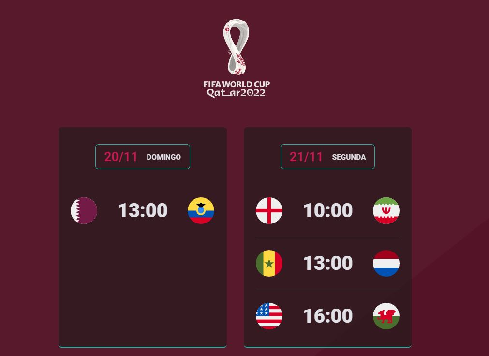

<h1 align="center"> Calendário - QTAR 2022 </h1>

Evento exclusivo e gratuito, promovido pela Rocketseat para ensino de tecnologias WEB.

  <a href="#-tecnologias">Tecnologias</a>&nbsp;&nbsp;&nbsp;|&nbsp;&nbsp;&nbsp;
  <a href="#-projeto">Projeto</a>&nbsp;&nbsp;&nbsp;|&nbsp;&nbsp;&nbsp;
  <a href="#-layout">Layout</a>&nbsp;&nbsp;&nbsp;|&nbsp;&nbsp;&nbsp;
  <a href="#memo-licença">Licença</a>

  

 

  

## 🚀 Tecnologias

Esse projeto foi desenvolvido com as seguintes tecnologias:

- HTML e CSS
- JavaScript e JSON
- Git e GitHub

## 💻 Projeto

O calendário é um projeto desenvolvido com base no projeto feito durante a NLW afim de expandir e melhorar os conhecimentos sobre HTML, CSS e JS. Com ele conseguimos visualizar os jogos da fase de grupo da Copa do Mundo de 2022

## 🔖 Layout

Você pode visualizar este projeto clicando [aqui](https://jflopes21.github.io/calendario-qtar-2022/) .

## :memo: Licença

Esse projeto está sob a licença MIT.

---

Feito com ♥ by Rocketseat :wave: [Participe da nossa comunidade!](https://discord.gg/rocketseat)